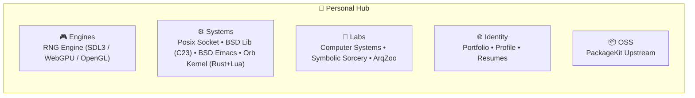

# 🚀 Personal Hub

> **Orquestrador Federado de Projetos Autorais, Engines Gráficas, Sistemas & Laboratórios**<br />
> _O quartel-general de desenvolvimento autoral e exploração de sistemas de Gabriel Frigo._

<div align="center">

[](LICENSE)
[](Systems/)
[](Identity/Portfolio/)
[](https://github.com/GabrielFrigo4/personal/actions/workflows/submodules.yml)
[](https://github.com/GabrielFrigo4)

</div>

---

## 📖 Visão Geral

O repositório **Personal** reúne projetos autorais de engenharia, motores gráficos, protocolos de rede, bibliotecas de sistema e experimentações de arquitetura. Ele é estruturado em **5 categorias modulares limpas**:



---

## 🧩 Os Componentes do Personal

| Categoria      | Submódulo                                          | Foco & Responsabilidade                       | Tecnologias                   | Repositório Remoto                                                                    |
| :------------- | :------------------------------------------------- | :-------------------------------------------- | :---------------------------- | :------------------------------------------------------------------------------------ |
| **`Engines`**  | [**`RNG Engine`**](Engines/RNG%20Engine/)          | Engine e jogo em computação gráfica moderna   | C/C++, SDL3, WebGPU, OpenGL   | [`GabrielFrigo4/rng-engine`](https://github.com/GabrielFrigo4/rng-engine)             |
| **`Systems`**  | [**`Posix Socket`**](Systems/Posix%20Socket/)      | Servidor HTTP concorrente explorando FDs      | C, POSIX.1, kqueue/epoll      | [`GabrielFrigo4/unix-sock`](https://github.com/GabrielFrigo4/unix-sock)               |
|                | [**`BSD Lib`**](Systems/BSD%20Lib/)                | Standard BSD Libraries em C23                 | C23, bmake, BSD 3-Clause      | [`GabrielFrigo4/SBL`](https://github.com/GabrielFrigo4/SBL)                           |
|                | [**`BSD Emacs`**](Systems/BSD%20Emacs/)            | Manifesto e arquitetura da nova máquina       | Elisp, C, Markdown            | [`GabrielFrigo4/bsd-emacs`](https://github.com/GabrielFrigo4/bsd-emacs)               |
|                | [**`Orb Kernel`**](Systems/Orb%20Kernel/)          | Microkernel assíncrono para Lua               | Rust, Tokio, Lua 5.5          | [`GabrielFrigo4/orb`](https://github.com/GabrielFrigo4/orb)                           |
| **`Labs`**     | [**`Computer Systems`**](Labs/Computer%20Systems/) | CS:APP Attack Lab e binários                  | C, Assembly, GDB              | [`GabrielFrigo4/ComputerSystems`](https://github.com/GabrielFrigo4/ComputerSystems)   |
|                | [**`Symbolic Sorcery`**](Labs/Symbolic%20Sorcery/) | Computação simbólica e homoiconicidade        | Common Lisp, SBCL             | [`GabrielFrigo4/symbolic-sorcery`](https://github.com/GabrielFrigo4/symbolic-sorcery) |
|                | [**`ArqZoo`**](Labs/ArqZoo/)                       | Estruturas de dados de lote e fluxo           | Rust, Cargo                   | [`GabrielFrigo4/ArqZoo`](https://github.com/GabrielFrigo4/ArqZoo)                     |
| **`Identity`** | [**`Portfolio`**](Identity/Portfolio/)             | Site institucional e servidor pessoal         | Rust, Tokio, Axum, Sockets    | [`GabrielFrigo4/gabrielfrigo`](https://github.com/GabrielFrigo4/gabrielfrigo)         |
|                | [**`Profile`**](Identity/Profile/)                 | README especial do perfil do GitHub           | Markdown, Shields.io, Mermaid | [`GabrielFrigo4/GabrielFrigo4`](https://github.com/GabrielFrigo4/GabrielFrigo4)       |
|                | [**`Resumes`**](Identity/Resumes/)                 | Acervo de currículos e cartas de apresentação | LaTeX, Make, GitHub Actions   | [`GabrielFrigo4/resumes`](https://github.com/GabrielFrigo4/resumes)                   |
| **`OSS`**      | [**`PackageKit`**](OSS/PackageKit/)                | Gerenciamento agnóstico de pacotes            | C, GLib, Polkit               | [`PackageKit/PackageKit`](https://github.com/PackageKit/PackageKit)                   |

---

## 🚀 Como Obter e Operar

```sh
# Clonagem recursiva
git clone --recursive "https://github.com/GabrielFrigo4/personal.git"
cd personal

# Ou clonagem simples seguida de bootstrap
git clone "https://github.com/GabrielFrigo4/personal.git"
cd personal
make clone
```

### Operações com o Makefile

```sh
make status    # Verifica estado de sincronização dos submódulos
make pull      # Atualiza submódulos com as branches principais remotas
make test      # Executa sanity checks locais
```

---

## 📜 Governança e Princípios

- **Princípios de Engenharia:** Consulte [PRINCIPLES.md](PRINCIPLES.md) para os 18 princípios canônicos aplicados.
- **AI Agent Briefing:** Instruções de operação para agentes autônomos em [AGENTS.md](AGENTS.md).
